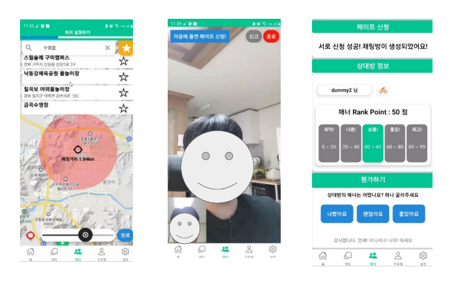

# 💪 나와 : 나와 잘맞는 동네 운동 메이트를 찾는 플랫폼

## 📜 설명

주변 지역에 공통 관심사의 운동을 가지고 있는 사람들과 매칭하여 만남을 가지게 해주어 운동 메이트를 찾게 해줍니다. 그리고 커뮤니티 공간을 통해 다양한 정보를 공유하며 소통할 수 있는 서비스입니다.

## 🗓️ 개발 기간

2022.07.11 ~ 2022.08.19

## 💡 주요 기능
- 나와 같은 관심사의 사람과 대화해볼 수 있는 가벼운 만남을 제공해주는 **매칭 서비스**
- 마음에 든 사람과 자유로운 대화 및 추후 일정을 도모할 수 있는 **친구 등록 서비스**
- 다른 사람들과 운동이나 여러 주제에 대한 소통 및 정보 습득을 위한 **커뮤니티 공간**

## 🛠️ 기술 스택

- React, React-native, Javascript, Typescript
- SpringBoot, Java, JPA, MySQL
- AWS EC2, Jenkins, Nginx

## 👥 멤버

- 프론트엔드
    - 임진현
    - 조호형
    - 한재혁
- 백엔드
    - 김주원
    - 이정재
    - 홍성목

## **🔗 자세한 내용**

- [Nawa : 운동 메이트를 찾는 플랫폼](https://www.notion.so/Nawa-90ea1a43143346988b8ce7e6b941c08d)
